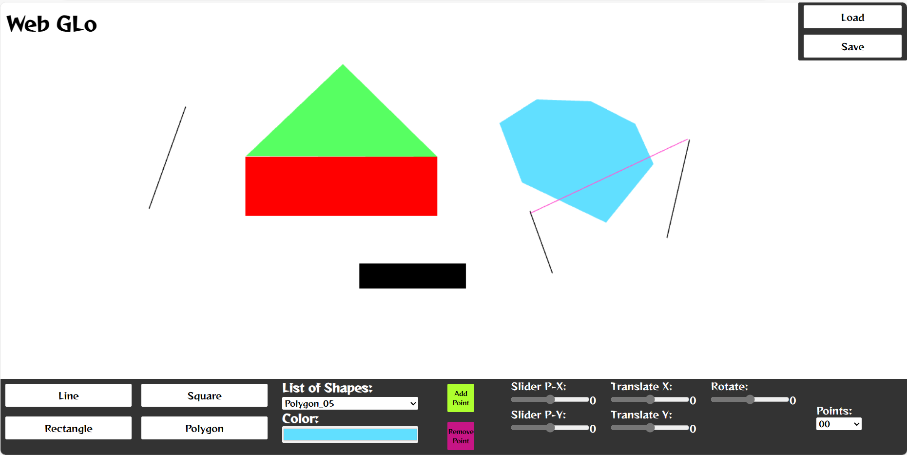

# Tugas Besar 1 - IF3260
For Computer Graphics Course - IF3260

Bandung, 2024


<p align="center">
  
</p>

## The Author
| NO | NAMA | NIM |
--- | --- | --- |
| 1 | Rizky Abdillah Rasyid | 13521109 |
| 2 | Jeremya Dharmawan Raharjo | 13521131 |
| 3 | Muhammad Zaki Amanullah | 13521146 |


## Overview
Tugas Besar ini merupakan Implementasi Program API WebGL sederhana untuk menggambar dan melakukan transformasi terhadap Model Primitif 2D yang meliputi garis, persegi, persegi panjang, dan poligon. WebGL sendiri merupakan sebuah standar web yang memungkinkan pengembang untuk membuat grafika 3D maupun 2D interaktif di dalam browser tanpa menggunakan plugin tambahan. Beberapa jenis transformasi geometri yang digunakan dalam implementasi WebGL 2D pada program ini antara lain: Translasi, Rotasi, dan Scaling.

## Program Features

1. Membuat Model Garis
2. Membuat Model Persegi
3. Membuat Model Persegi Panjang
4. Membuat Model Poligon
5. Melakukan Transformasi Geometri (Translasi, Rotasi, dan Dilatasi)
6. Menggerakan Vertex dari Suatu Model
7. Mewarnai Model yang dibuat
8. Menyimpan / Melakukan Load Model

## Project Structure
```
.
|   .editorconfig
|   .gitignore
|   index.html
|   package-lock.json
|   package.json
|   README.md
|   style.css
|   tsconfig.json
|   webpack.config.js
|   
+---doc
|       Tubes1_IF3260_13521109_13521131_13521146.pdf
|       
+---src
|   |   index.ts
|   |   
|   +---enum
|   |       ShapeEnum.ts
|   |       
|   +---handler
|   |   |   DrawHandler.ts
|   |   |   ToolsHandler.ts
|   |   |   
|   |   \---ShapeHandler
|   |           LineHandler.ts
|   |           PolygonHandler.ts
|   |           RectangleHandler.ts
|   |           SquareHandler.ts
|   |           
|   +---io
|   |   |   FileHandler.ts
|   |   |   ShapeFactory.ts
|   |   |   
|   |   \---bind
|   |           BaseBind.ts
|   |           ShapeBind.ts
|   |           
|   +---math
|   |       Matrix.ts
|   |       Transform.ts
|   |       Vector2D.ts
|   |       VertexOperation.ts
|   |       
|   +---object
|   |   +---base
|   |   |       Color.ts
|   |   |       Coordinate.ts
|   |   |       Vertex.ts
|   |   |       
|   |   \---shape
|   |           Line.ts
|   |           Polygon.ts
|   |           Rectangle.ts
|   |           Shape.ts
|   |           Square.ts
|   |           
|   \---utils
|           algorithm.ts
|           program.ts
|           render-props.ts
|           resize.ts
|           shaders.ts
|           
\---test
        test_emyu.json
        test_membadut.json
        test_topi_kapal.json

```


## How To Build & Run the program?
```
1. Clone repository ini ke direktori lokal anda. Jalankan perintah di bawah berurutan.
2. `npm install`
3. `npm install -g live-server`
4. `npm run dev`
5. `live-server`
6. Atau anda dapat membuka index.html pada folder ini di browser anda
```
